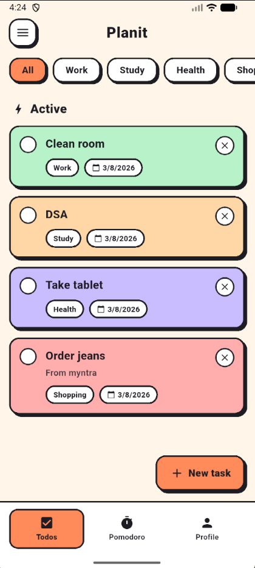
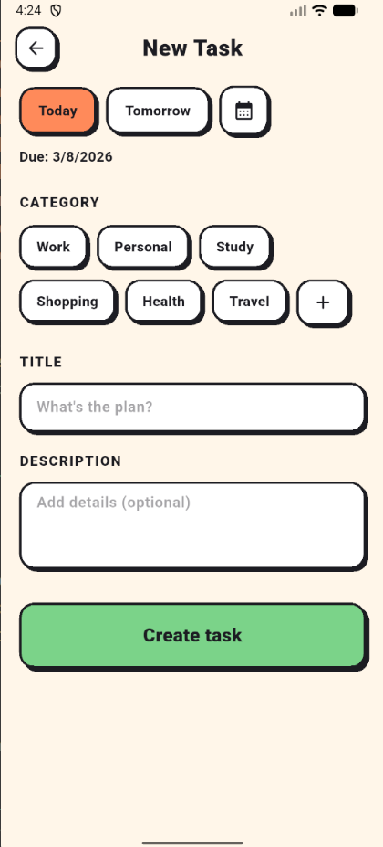
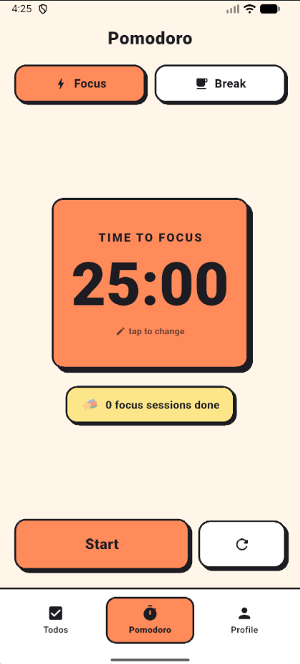
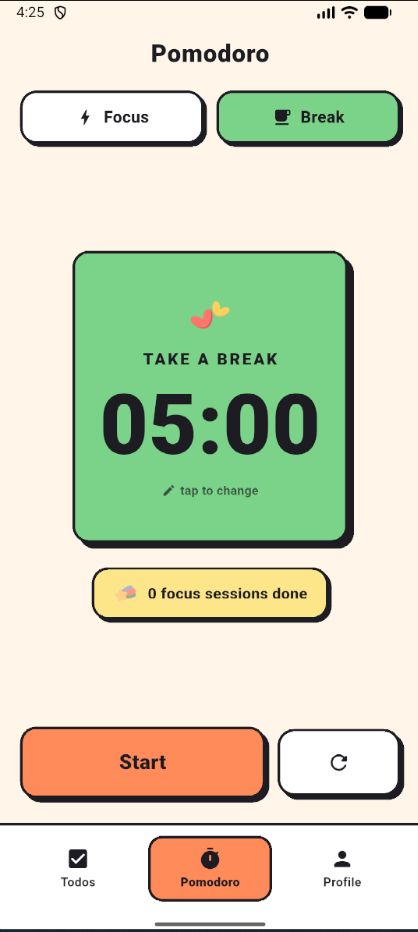
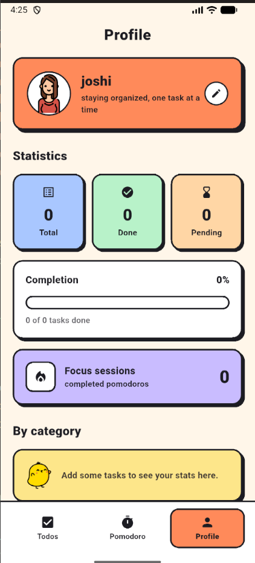

<p align="center">
  
</p>

<h1 align="center">✅ Planit</h1>

<p align="center">
A cute, offline-first Flutter to-do app with a neo-brutalism design — organise your day with colour-coded tasks, stay focused with a built-in Pomodoro timer, and track your progress. No accounts, no cloud; everything lives on your device.
</p>

---

## 🚀 Overview

**Planit** is a local-first task manager built with Flutter. It stores everything
on-device using **Drift (SQLite)** — there is no sign-up, no server, and no
internet required. A friendly onboarding flow gets you started, a lightweight
profile keeps things personal, and a Pomodoro timer helps you actually get
things done.

### What it offers:
- Create, complete, and delete tasks with categories and due dates
- Filter tasks by category
- A customizable Pomodoro focus/break timer
- Personal statistics (completion, pending, focus sessions, per-category)
- A local profile with a name, email, and avatar

---

## ✨ Features

- 👋 First-run **onboarding** slides
- 🧑‍🎨 **Profile setup** — name, email, and pick-an-avatar
- 📝 **Tasks** with title, description, category, and due date
- 🗂️ **Colour-coded categories** with quick filtering
- ✅ One-tap **complete / delete**
- 🍅 **Pomodoro timer** with user-adjustable focus & break lengths
- 📊 **Statistics** — total, done, pending, completion %, and focus sessions
- 🐾 Cute **mascot illustrations** for empty & all-done states
- 🎨 Bold **neo-brutalism** UI
- 🔒 **100% offline** — all data stored locally with Drift
- ⚡ Lightweight and fast

---

## 🖼️ Screenshots

<p align="center">
  
  
  
  
  
</p>

---

## 🧰 Tech Stack

| Layer | Technology |
|-------|------------|
| Framework | Flutter |
| Language | Dart |
| State management | Riverpod (with code generation) |
| Local database | Drift (SQLite) |
| Functional error handling | fpdart (`Either`) |
| Architecture | MVVM (model · repository · viewmodel · view) |
| Platforms | Android, iOS, Web*, Desktop* |

<sub>*Drift uses a native SQLite backend; running on web requires a WASM/worker setup.</sub>

---

## 📦 Dependencies

| Package | Purpose |
|---------|---------|
| `flutter_riverpod` / `riverpod_annotation` | State management |
| `drift` / `sqlite3_flutter_libs` | Local SQLite database |
| `path` / `path_provider` | Resolve the on-device database location |
| `fpdart` | `Either`-based error handling in repositories |
| `uuid` | Generate unique task ids |
| `url_launcher` | Open external links (GitHub) |
| `flutter_launcher_icons` | App icon generation |
| `drift_dev` / `riverpod_generator` / `build_runner` | Code generation (dev) |

---

## 📁 Project Structure

```
planit/
│
├── assets/
│   ├── icon/          # app icon
│   ├── onboarding/    # onboarding illustrations
│   ├── profiles/      # selectable avatars
│   └── mascots/       # cute empty / all-done illustrations
│
├── lib/
│   ├── core/
│   │   ├── constants/   # app + asset constants
│   │   ├── database/    # Drift database + providers
│   │   ├── error/       # Failure type
│   │   ├── theme/       # colours + neo-brutalism theme
│   │   └── utils/       # helpers (snackbars, etc.)
│   ├── models/          # Task, UserProfile
│   ├── repository/      # todo / profile / settings repositories
│   ├── viewmodels/      # Riverpod notifiers (task, pomodoro, profile, onboarding)
│   ├── views/
│   │   ├── widgets/     # NeoBox, NeoButton, AppLogo, mascots, drawer…
│   │   ├── main_shell.dart      # bottom-nav shell
│   │   ├── onboarding_page.dart
│   │   ├── profile_setup_page.dart
│   │   ├── home_page.dart
│   │   ├── add_task_page.dart
│   │   ├── pomodoro_page.dart
│   │   └── profile_page.dart
│   ├── screens/         # about page
│   └── main.dart
│
├── android/  ├── ios/  ├── web/  ├── windows/  ├── macos/  ├── linux/
│
├── pubspec.yaml
└── README.md
```

---

## ⚙️ Installation & Run

### Prerequisites

* Flutter SDK (latest stable)
* Android Studio / VS Code
* Emulator or physical device

### Steps

```bash
# 1. Clone
git clone https://github.com/joshitha1808/planit.git
cd planit

# 2. Install dependencies
flutter pub get

# 3. Generate code (Drift + Riverpod)
dart run build_runner build --delete-conflicting-outputs

# 4. Run
flutter run
```

> ℹ️ Step 3 is required because the project uses code generation for Drift and
> Riverpod (`*.g.dart` files). Re-run it whenever you change a table,
> `@riverpod` provider, or model.

---

## 🗄️ Data & Privacy

Planit is **fully offline**. All tasks, your profile, and preferences are stored
locally in an on-device SQLite database via **Drift**. Nothing is sent anywhere —
there are no accounts and no network calls for your data.

---

## 📄 License

This project is licensed under the **MIT License**.

---

⭐ If you find this project useful, consider giving it a star!
